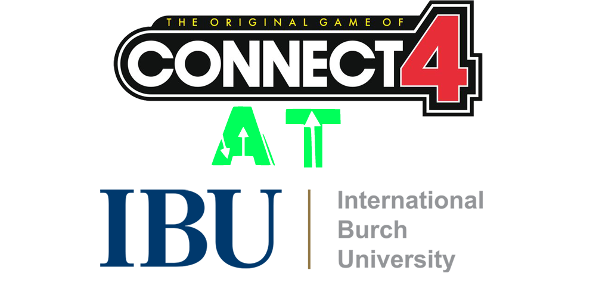

# Connect Four game done in Rust 

<!-- PROJECT LOGO -->
<br />
<div align="center">
  <a href="https://github.com/saba8814/pl-project-connect-four">
    
  </a>

### Project in IT Programming Languages @ International Burch University 👨‍💻</div>  
  

- 🔭 For this project we were using Rust Language
(https://github.com/saba8814/pl-project-connect-four)  
  

- 🌱 Hope you have great time playing (May odds be in your favor😉)  
  

- ❓ If you have any questions, feel free to contact us🤖  
  
  <br>
  <br>
  
<div align="center">
     
  
 </div> 

<br/>  

<!-- ABOUT PROJECT-->
## About the Project 

Connect Four is a two-player connection board game, in which the players choose a color and then take turns dropping colored tokens into a vertically suspended grid. Whichever player manages to connect 4 tokens of the same color horizontally, vertically or diagonally wins the game.

As mentioned above, this project was done in IT 305 Programming Languages course at International Burch University, and implemented in the RUST programming language.

<br>
<br>

<!-- ABOUT RUST -->
### About Rust  


<a href="https://www.rust-lang.org/" target="_blank"></a>  

Graydon Hoare designed Rust while working with Mozilla, aiming to create a statically typed, compiled, open-source programming language with a syntax similar to C++. The first release came in 2010, and since then the language has been enhanced significantly. Little known fact, Dropbox is built on Rust.

Rust is a systems-level programming language designed with safety in mind. The compiler is there to help you every step of the way, and barring any logic flaws, there’s a pretty good chance your code will work – even if there are a few little mistakes or hiccups.

C++ compiler messages are notoriously difficult to decipher, and while they’ve made huge advancements on how errors are communicated, Rust does it on a whole other level. There is a reason why Rust is one of the hottest programming languages used today.

It’s estimated that there are almost a million rust developers world-wide, and while these sound like rookie numbers when compared to the tens of millions that use JavaScript and Python, it’s still significant.
<br>
<br>
### Why use Rust?

<b>1 – I Am Speed: </b>
<br>
Rust’s speed makes it a pretty good candidate for developers looking to create a game engine. It’s the smart choice for applications that use Virtual Reality to build a simulation. It’s not limited to just gaming though, and can be used as the basis of an operating system, file system, or to write browser components.

<b> 2 – Safety First: </b>
<br>
Unlike other programming languages that leave you flipping over tables in a blind nerd rage, or tearing out your hair out of pure frustration, Rust offers memory safety and will actively reduce common programming errors.

When building something like a large-scale system where security is important, the inherent design of Rust reduces application security vulnerabilities. It makes debugging and testing a breeze, which is usually the job you’re palming off as somebody else’s problem.

Finding errors fast and eliminating them with ease results in…

<b> 3 – Less Is More:</b>
<br>
Rust arguably supports more code complexity than any other programming language. It supports generics, and you’ll find it way easier to build powerful web apps using Rust.

In fact, Rust integrates almost ridiculously well with other popular programming languages to create workable interfaces between code.

<b> 4 – Cross Dresser: </b>
<br>
Cross platform development is a huge feather in Rust’s cap, and powerful, robust performance across multiple applications is something developers are looking for in a programming language.

<b> 5 – Giving Back to The Community:</b>
<br>
There is a huge, vibrant developer community out there with plenty of how-to’s, tutorials, and webinars on working with Rust. Though the user base is a fraction of that of other programming languages, the community is super helpful and close knit. This is what you want, instead of being met with the jaded toxicity of trolls that lurk in the Java message boards.

<br/>  


<!-- FEATURES-->
## Features of this project


- Resizable Board ✖️  
  

- Saving Game💾  
  

- Loading Game 🔁 
  

- Sound effects🔊  
  

- Supporting major platforms (Windows, Linux, Mac OS) 🖥️  
  


<br>
<br>


<!-- ABOUT TEAM MEMBERS -->
## Connect with us 


### Ejub Šabić  
<a href="https://github.com/https://github.com/saba8814" target="_blank">

</a>
<a href="https://linkedin.com/in/https://www.linkedin.com/in/ejub-sabic/" target="_blank">

</a>
<a href="https://instagram.com/ejub.sabic" target="_blank">

</a>  
  


### Amar Fazlić  
<a href="https://github.com/https://github.com/amar-exe" target="_blank">

</a>
<a href="https://linkedin.com/in/https://www.linkedin.com/in/amar-fazlic-84b747184/" target="_blank">

</a>
<a href="https://instagram.com/amar.exe" target="_blank">

</a>  
  


### Saliha Mustafić  
<a href="https://github.com/https://github.com/S-a-l-i-h-a" target="_blank">

</a>
<a href="https://linkedin.com/in/https://www.linkedin.com/in/saliha-mustafic/" target="_blank">

</a>
<a href="https://instagram.com/iamsaliha" target="_blank">

</a>  
  

<br>  
<br>
 

<!--HOW TO RUN -->
## How to run?  

- To run the project, you will first need to install Rust. You can find detailed instructions <a href="https://www.rust-lang.org/tools/install">on this link</a>.

- After installing Rust, follow these steps to run the game:
 ```
   git clone  https://github.com/saba8814/pl-project-connect-four
   cd cargo-run
   
   ```

 
